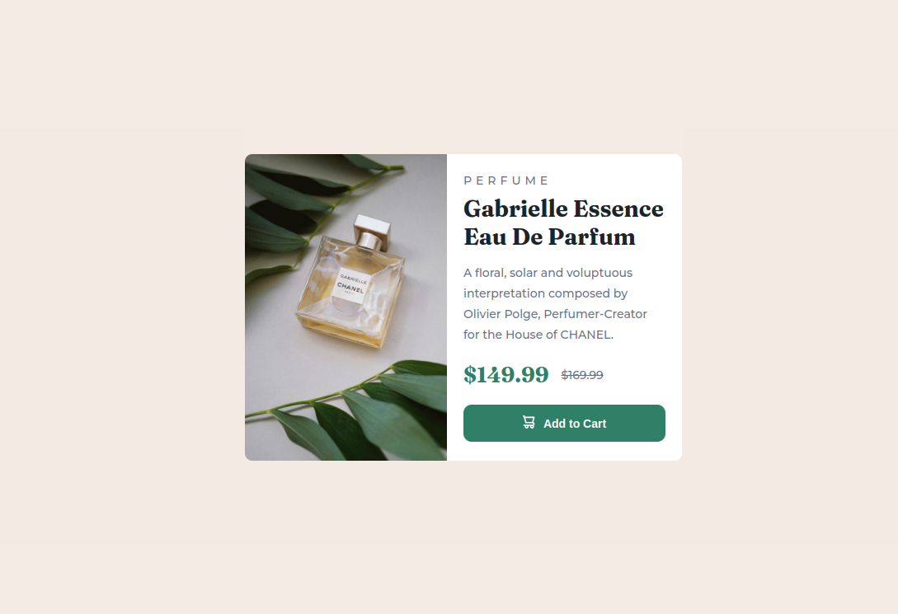

# Frontend Mentor - Product preview card component solution

This is a solution to the [Product preview card component challenge on Frontend Mentor](https://www.frontendmentor.io/challenges/product-preview-card-component-GO7UmttRfa). Frontend Mentor challenges help you improve your coding skills by building realistic projects. 

## Table of contents

- [Overview](#overview)
  - [The challenge](#the-challenge)
  - [Screenshot](#screenshot)
- [Links](#links)
- [Built with](#built-with)
- [Author](#author)
- [Acknowledgments](#acknowledgments)


### The challenge

Users should be able to:

- View the optimal layout depending on their device's screen size


### Screenshot



### Links

- Live Site URL: [Page Link](https://xulab5.github.io/Product-preview-card-component/)

### Built with

- Semantic HTML5 markup
- Bootstrap

To see how you can add code snippets, see below:

```html
 <main>
    <div class="card">
      <div class="card-img">
        
        
      </div>
      <div class="card-info">
        <div class="card-info__content">
          <p>Perfume</p>
          <h1>Gabrielle Essence Eau De Parfum</h1>
          <p class="card-info__text">
            A floral, solar and voluptuous interpretation composed by Olivier Polge, 
            Perfumer-Creator for the House of CHANEL.
          </p>
          <div class="card-info__price">
            <span>$149.99</span>
            <span>$169.99</span>

          </div>
          <div class="card-info__btn-container">
              <button class="btn">  
                <span></span> <span>Add to Cart</span> 
              </button>
          </div>
        </div>
      </div>
    </div>
  </main> 
  <footer>
    <div class="attribution">
      Challenge by <a href="https://www.frontendmentor.io?ref=challenge" target="_blank">Frontend Mentor</a>. 
      Coded by <a href="#">Steven Sub</a>.
    </div>
  </footer>
```


## Author

- Website - [Xulab](https://substeven.netlify.app/)
- Frontend Mentor - [@Xulab05](https://www.frontendmentor.io/profile/Xulab5)
- Instagram - [@Xulab05](https://www.instagram.com/xulab05/)

## Acknowledgments
I'd like to give thanks to Front-end for this awesome short project.
